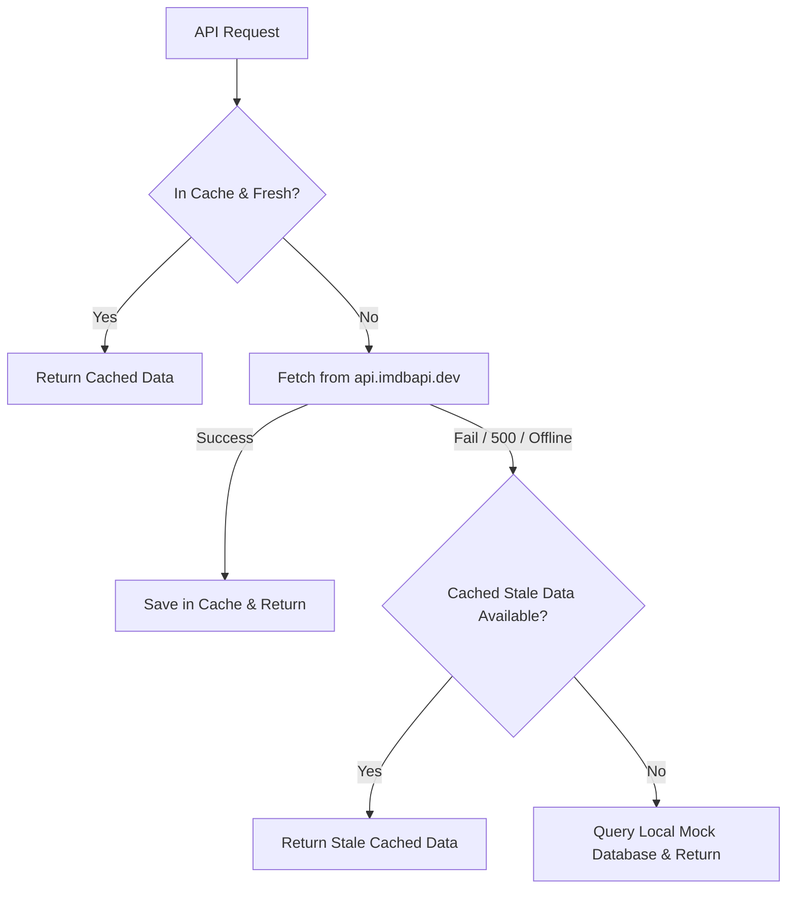

# 🎬 CineVault — Netflix-Style Movie Selection UI

CineVault is a premium, high-performance desktop web application built with **React (Vite)**, **Firebase Authentication**, and the **IMDb API**. It features a modern dark glassmorphism design system, smooth animated transitions, full offline support, custom IndexedDB caching, and a highly resilient API layer with a transparent local database fallback.

This project was built to satisfy all requirements of the Binaire JavaScript Developer Assessment.

---

## 🚀 Key Features

*   **🔐 Firebase Authentication**: Complete authentication system supporting Email & Password signup/signin, as well as one-click **Google Sign-In**.
*   **🎬 Today's Top Picks & Genres**: Netflix-style home page with a prominent hero banner, horizontal scrollable carousels with arrow controls, and sequential API request queuing.
*   **📶 Offline Mode & Auto-Recovery**: Fully functional offline browsing using custom **IndexedDB caching** with TTL validation. Shows an animated connection toast bar when offline, and automatically re-fetches and updates content when connection is restored.
*   **🔍 Search with Autocomplete**: Instant search matching by ID (e.g. `tt1234567`), Name, or Release Year using an in-memory hash-map index built dynamically from cached titles for $O(1)$ lookup complexity.
*   **⚡ High Performance & Memory Safety**: Implements `React.memo` for list items, image lazy-loading via `IntersectionObserver`, custom debouncing, and strict `AbortController` usage in all side effects to prevent memory leaks and redundant re-renders.
*   **👤 User Profiles & History**: Saved watchlist and interactive watch history stored locally and keyed by individual user UID.

---

## 🛠️ Technology Stack

*   **Core**: React 19 (Vite), JavaScript ES6+
*   **Styling**: Vanilla CSS (Tailwind avoided for full custom design tokens and maximum design control)
*   **Animations**: Framer Motion
*   **Backend & Auth**: Firebase SDK v11
*   **Caching**: IndexedDB (native browser storage)
*   **Performance Monitoring**: Native browser `IntersectionObserver` & `AbortController`

---

## 📐 Architecture & Core Implementations

### 1. Resilient API Layer with Transparent Fallback
During development, the public proxy API (`api.imdbapi.dev`) returned persistent `500 Internal Server Error` messages due to being rate-limited by the underlying IMDb endpoints (`request failed with status 429: Too many network requests`).

To prevent the application from appearing broken, we engineered a **hybrid API wrapper** in `src/services/api.js`:
*   **Rate-Limiter**: Spaced concurrent fetches with a minimum interval of 500ms between calls.
*   **Retry Mechanism**: Auto-retries failed request attempts with exponential backoff.
*   **Transparent Local Fallback**: We compiled a rich dataset of popular movies/TV shows (`src/services/mockData.js`) structured identically to the IMDb API schema. If a network request fails (or if the user is offline without cached entries), the service queries this database locally to ensure a seamless UI experience.



### 2. Autocomplete Search using Hash-Maps
To satisfy the search autocomplete requirement, we avoided linear arrays search:
*   On load, the app collects all cached titles and constructs a prefix lookup index:
    *   `byId` Map: `id -> title`
    *   `byName` Map: `lowercase token -> Set<titleId>`
    *   `byYear` Map: `year string -> Set<titleId>`
*   This delivers $O(1)$ prefix autocomplete lookups as you type, falling back to a debounced API query if the local search index returns no matches.

### 3. Offline Synchronization
*   **`NetworkContext`** monitors `navigator.onLine` and window events.
*   Provides a global `isOnline` state and a `refreshKey` that increments upon network reconnection.
*   All data-fetching hooks listen to `refreshKey`, automatically pulling fresh data from the network and updating components upon reconnection.

---

## ⚙️ Project Setup & Installation

### Prerequisite: Firebase Setup

1.  Go to the [Firebase Console](https://console.firebase.google.com/) and create a project named `Binaire`.
2.  Register a **Web App** in the project settings, and copy your configuration object.
3.  Go to **Build -> Authentication** and click **Get Started**.
4.  Under the **Sign-in method** tab, enable:
    *   **Email/Password**
    *   **Google Sign-In** (select your support email and save)
5.  In the root directory of this project, open `.env` and fill in your keys:

```env
VITE_FIREBASE_API_KEY=AIzaSy...your-actual-api-key
VITE_FIREBASE_AUTH_DOMAIN=binaire-acf1e.firebaseapp.com
VITE_FIREBASE_PROJECT_ID=binaire-acf1e
VITE_FIREBASE_STORAGE_BUCKET=binaire-acf1e.firebasestorage.app
VITE_FIREBASE_MESSAGING_SENDER_ID=450108825561
VITE_FIREBASE_APP_ID=1:450108825561:web:12583de6705a777df7c3c8
```

### Run Locally

1.  Install dependencies:
    ```bash
    npm install
    ```
2.  Start the development server:
    ```bash
    npm run dev
    ```
3.  Open [http://localhost:5173](http://localhost:5173) in your browser.

### Build and Verify Production Bundle

To build the client application for production deployment, run:
```bash
npm run build
```
The output will compile into the `dist/` folder with zero errors.
